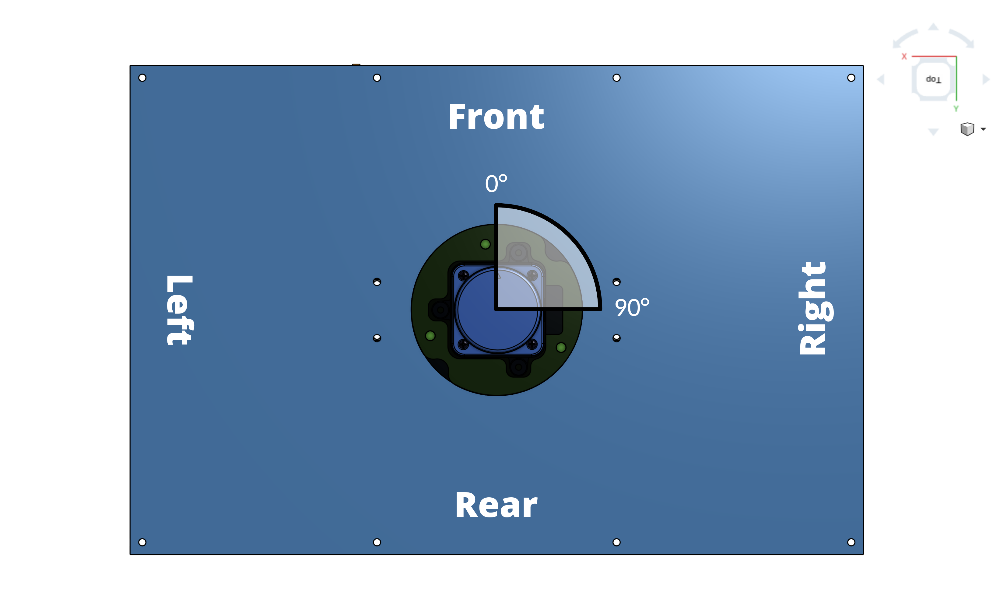
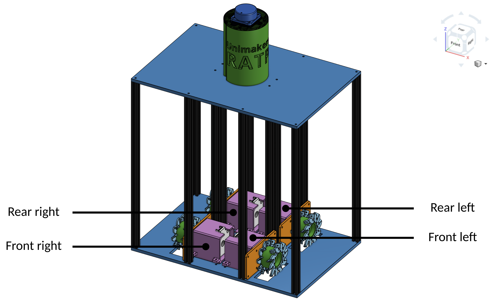
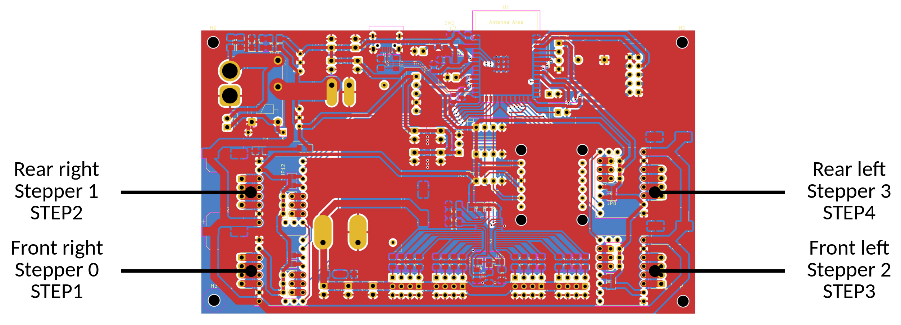

# RATP - CDR 2025

This directory is dedicated to the robot built by the RATP team for the [2025 French Robotics Cup](https://www.coupederobotique.fr/edition-2025/) which will take place from May 28 to 31.

The robot uses LiDAR technology and mecanum wheels for movements in any direction.

The goal of this project is to be more conventional and more scalable than the previous CDR project. The ultimate goal is for it to be reusable in our future participations.

Here are some standards set by the team for the project.

## Movements

The robot is composed of four NEMA 17 stepper motors set to 1/8 step. Each mecanum wheel measures XX mm in diameter. The robot is configured as follows :

    
    
    

## Strategy

For each game, the robot follows a strategy. Each strategy consists of a sequence of actions performed one after the other, listed in a vector called `actions`. The strategies are stored in the [`include/strategies`](./include/strategies) directory and should be imported into [`Strategy.cpp`](./lib/Strategy/Strategy.cpp).

The possible actions in a strategy are :
- Go to a position from the (0,0) position (absolute)
- Go to a position from the current position (relative)
- Perform a rotation from the (0,0) rotation (absolute)
- Perform a rotation from the current rotation (relative)
- Grab a plank
- Release a plank
- Grab a pot
- Release a pot

They are illustrated as an example in the file [`strat-0.h`](./include/strategies/strat-0.h).

## LiDAR

The robot is equipped with LiDAR technology to detect enemies. It scans in the direction of the robot's movement, the opposing robot. The angle of analysis of the points is 90°.

## Actuators

The robot is equipped with actuators to interact with objects on the field.

# TODO

- [x] Fix `UniBoardV4Def.h: No such file or directory`
- [x] Fix `undefined reference to 'DoubleMap<AccelStepper>::operator'`
- [x] Implement the game timer
- [x] Simplify DoubleMap using enum type
- [x] Implement LiDAR in the Movement class
- [ ] Run LiDAR on an unused core
- [ ] Implement full LiDAR detection scope for rotations
- [x] Implement `stop()` and `fullstop()` functions (Movement and Strategy)
- [ ] Define a default speed and acceleration
- [x] Update `currentPos` and `liveCurrentPos` with `maxSteps`
- [x] Implement `rotateTo()` and `rotateBy()` functions
- [x] Bind board connectors to real connectors
- [ ] Define global enum types
- [ ] Update the [strategy generator](https://robin864.github.io/StrategyToolbox/pages/strategy-2024/generateur-2024.html) to make it compatible with the robot's program